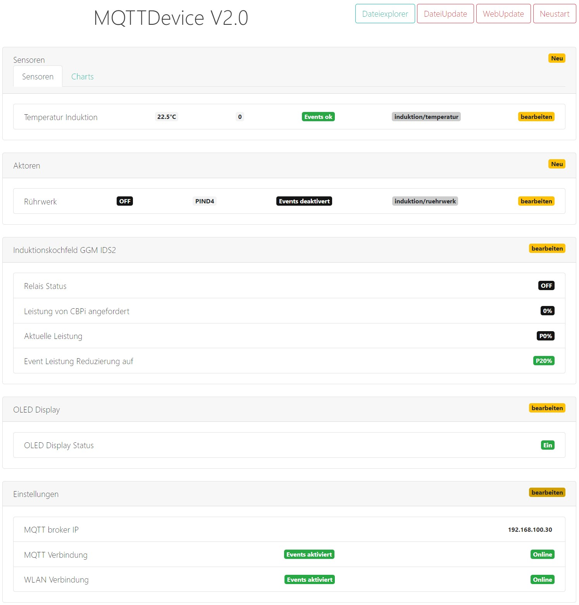
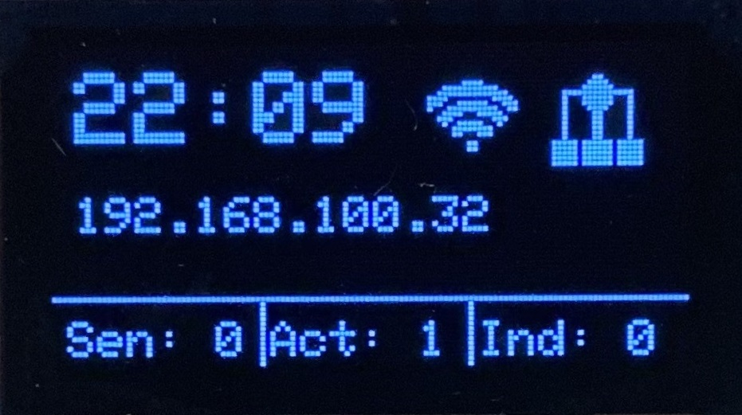
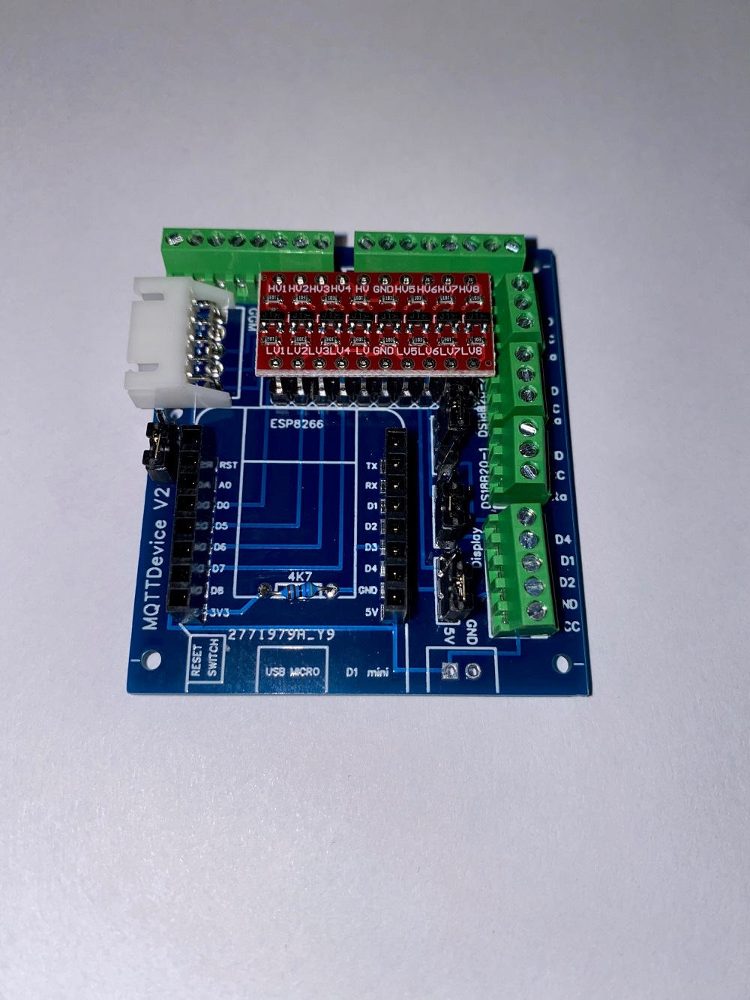
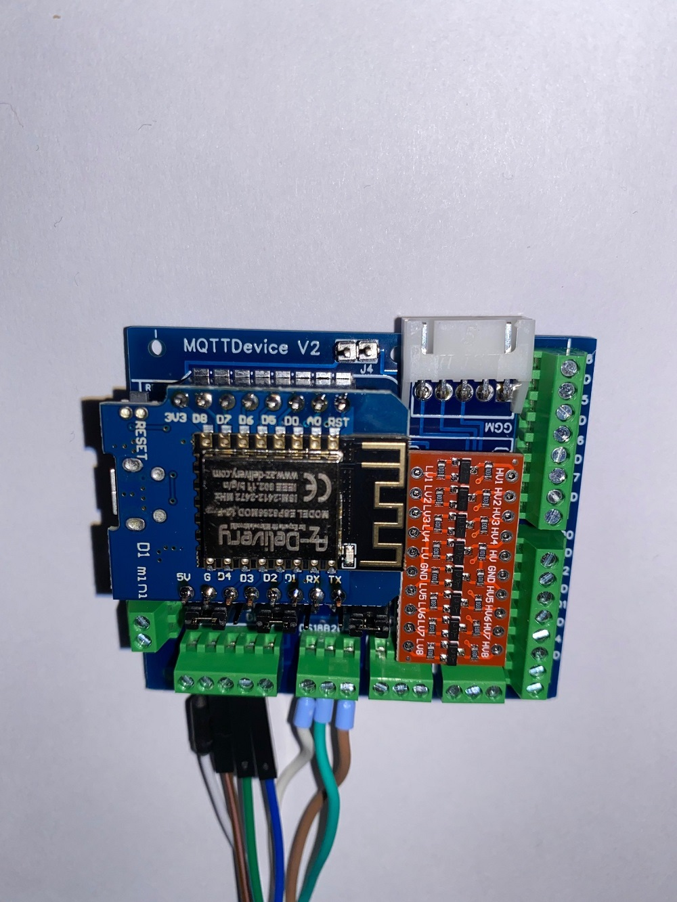
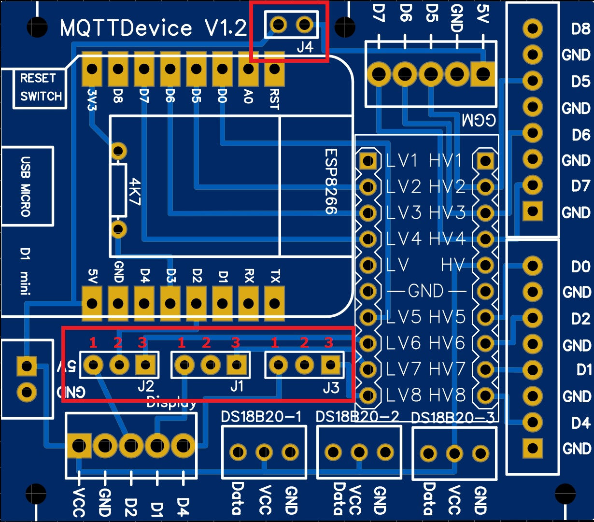
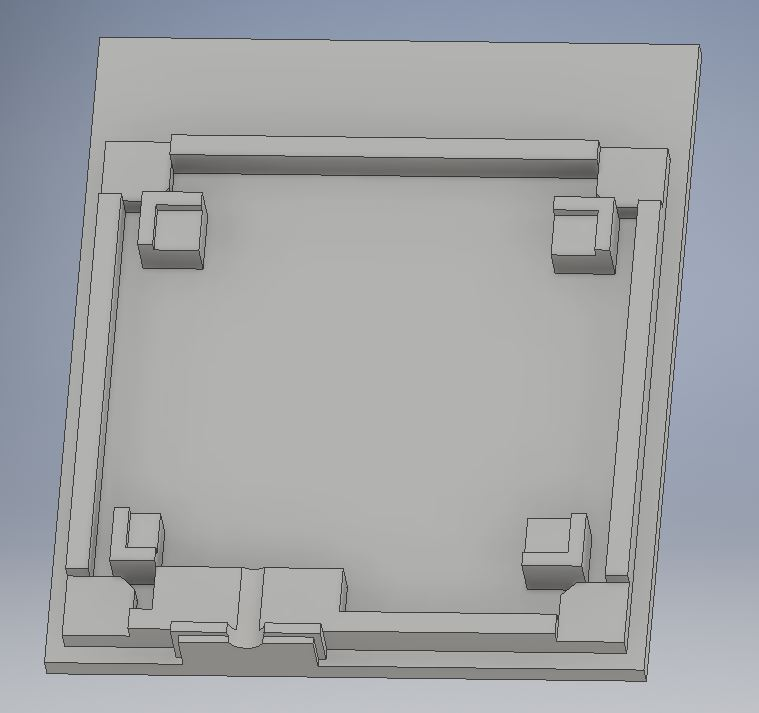
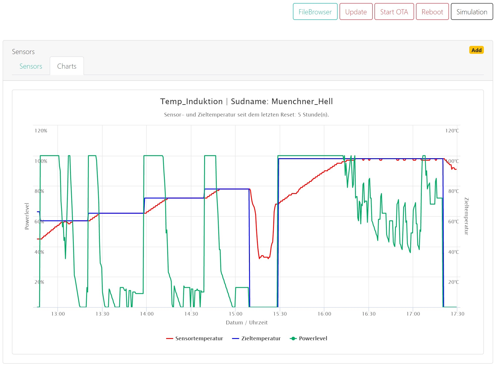
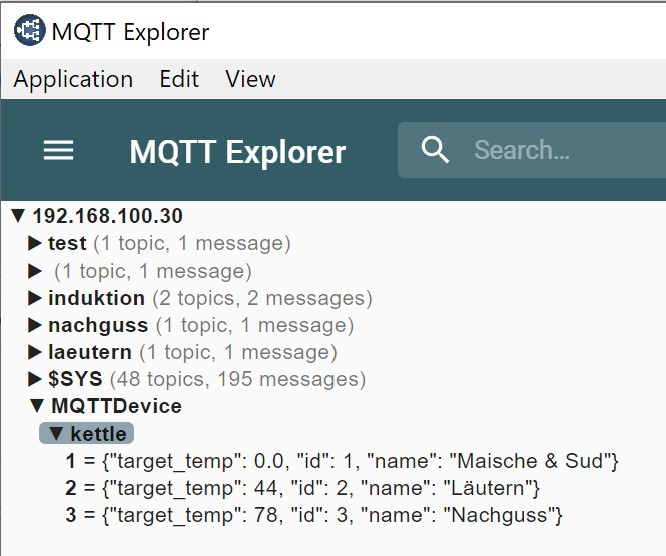
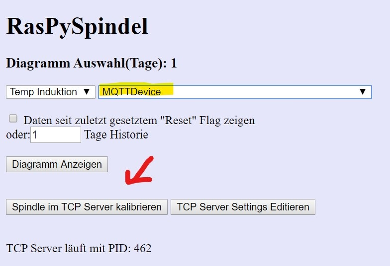

# MQTTDevice Version 2

**Was ist ein MQTTDevice?**

MQTTDevice ist ein Arduino Sketch für die Module ESP8266 Wemos D1 mini. Damit ist es möglich eine Kommunikation zwischen einem MQTT Broker und einem ESP8266 herzustellen, um Sensoren und Aktoren mit CraftbeerPi (CBPi) zu steuern.

**Was bietet diese Firmware?**

* Ein Web Interface (WebIf) für die Konfiguration
* Sensoren (max 6)
  * Suche nach angeschlossenen Sensoren basierend auf OneWire Adressen
  * Das Leseintervall der Sensordaten und das Offset sind konfigurierbar (in Sek)
* Aktoren (max 6)
  * PIN Auswahl (GPIO)
  * PINs in Verwendung werden ausgeblendet
  * Invertierte GPIO
  * Power Percentage: Es werden Werte zwischen 0 und 100% gesendet. Das ESP8266 "pulses" mit einem Zyklus von 1000ms
* Induktionskochfeld
  * das Induktionskochfeld GGM IDS2 kann direkt gesteuert werden
* OLED Display Integration
* WebUpdate Firmware
* Update Firmware und SPIFFS über Datei Upload
* Event handling
* TCP Server Support (Tozzi Server)
* Dateiexplorer

Dieses Projekt wurde im hobbybrauer Forum gestartet und dient dem Informationsaustausch.
Forum: <https://hobbybrauer.de/forum/viewtopic.php?f=58&t=19036&p=309196#p309196>

# Installation

**Installation ohne den Quellcode zu compilieren:**

Mit Hilfe von esptool.exe (<https://github.com/igrr/esptool-ck/releases> ) aus dem Ordner tools kann die Firmware auf das ESP Modul geladen werden. Das ESPTool ist für verschiedene Betriebssysteme verfügbar.
ESPtool-ck Copyright (C) 2014 Christian Klippel ck@atelier-klippel.de. This code is licensed under GPL v2.

Unter Win10 wird der USB Treiber CH341SER benötigt: <http://www.wch.cn/download/CH341SER_ZIP.html>

Beispiel für ein ESP8266 Modul vom Typ Wemos D1 mini mit 4MB Flash verbunden mit COM3

* Von github das Archiv Firmware.zip aus dem Ordner Tools herunterladen und irgendeinem Ordner entpacken

  * Das Archiv enthält das esptool zum Flashen, das Skript Flashen.cmd und die zwei Firmware Dateien

  * Doppelklick auf die Datei Flashen.cmd.

  Fertig!

  Sollte COM3 nicht der richtige Anschluss für den Wemos D1 mini sein, muss im Skript Flashen.cmd an zwei Stellen COM3 durch den richtigen Anschluss ersetzt werden.

  Alternativ manuell mit esptool:

  * Wemos D1 mini löschen: (Beispiel wieder an COM3)
        esptool.exe -cp COM3 -cd nodemcu -ce
        * Flashen:
        esptool.exe -cp COM3 -cd nodemcu -ca 0x000000 -cf MQTTDevice2.ino.bin -ca 0x200000 -cf MQTTDevice2.spiffs.bin

    * Das ESP8266 Modul resetten

      * Das ESP8266 Modul startet anschließend im Access Point Modus mit der IP Adresse 192.168.4.1

        * Das ESP8266 Modul über einen Webbrowser mit dem WLAN verbinden

        * Anschließend ist das MQTTDevice erreichbar über <http://mqttdevice>

**Installation mit Quellcode:**

Voraussetzungen: (2020.02)

* Arduino IDE 1.8.10
* Optional Microsoft VSCode + Arduino + ESP8266FS
* ESP8266 by ESP8266 Community version 2.6.3
* Folgende Bibliotheken müssen über die Arduino IDE hinzugefügt werden:
  * Standard Bibliotheken (buildin) von der Arduino IDE
    * ESP8266WiFi
    * ESP8266WebServer
    * DNSServer
    * ESP8266mDNS
    * SPI
    * Wire
  * Zusätzliche Bibliotheken
    * NTPClient by Fabrice Weinberg Version 3.2.0
    * Adafruit GFX Library by Adafruit Version 1.7.3
    * Adafruit SSD1306 by Adafruit Version 2.0.4
    * ArduinoJSON by Benoit Blanchon Version 6.13.0
    * DallasTemperature by Miles Burton Version 3.8.0
    * OneWire By Jim Studt Version 2.3.5
    * PubSubClient by Nick O'Leary Version 2.7.0
    * WiFiManager by tzapu Version 0.15.0
    * EventManager
    * InnuTicker (im Repository enthalten)

    Die Firmware muss mit der Einstellung Flash size 4MB (FS: 2MB OTA:~1019kB) aufgespielt werden.
    Debug Ausgaben werden in der IDE über "Debug Port" aktiviert. In der Standard Einstellung (bin Dateien) hat die Firmware nach dem Start keine Ausgaben auf dem seriellen Monitor.

**Updates:**

Die Firmware bietet zwei Möglichkeiten, um Updates sehr einfach einspielen zu können.

1. Update durch Dateiupload

    Im Webbrowser die URL <http://mqttdevice/update> aufrufen.
    Hier kann Firmware und das Filesystem SPIFFS aktualisiert werden. Wenn das Filesystem SPIFFS mit Dateiupload aktualisiert wird, wird die Konfigurationsdatei überschrieben. Siehe Backup und Restore.

2. WebUpdate

    Im Webbrowser die URL <http://mqttdevice> aufrufen und die Funktion "WebUpdate" aufrufen.
    WebUpdate aktualisiert die Firmware, die index Datei und Zertifikate. Durch WebUpdate wird die Konfigurationsdatei nicht überschrieben.

**Backup and Restore der Konfiguration:**

Der Dateiexplorer ist erreichbar über den Webbrowser <http://mqttdevice/edit>

1. Backup

    Auf die Datei config.txt klicken und aus dem PopUp Download auswählen.

2. Restore

    Auf Datei auswählen klicken, die config.txt auswählen und Upload auswählen

# Verwenden der Firmware

Die meisten Funktionen der Firmware sind selbsterklärend. Das Hinzufügen oder das Löschen von Sensoren und Aktoren wird daher hier nicht beschrieben.

**Die Hauptfunktionen:**

    * Hinzufügen, editieren und löschen von Sensoren
    * Auto reconnect MQTT
    * Auto reconnect WLAN
    * OLED Display optional konfigurieren
    * System Einstellungen vollständig veränderbar
    * Firmware und SPIFFS Updates über Dateiupload
    * Firmware WebUpdate
    * Filebrowser für einefaches Datei-Management (zB backup und restore config.json)
    * DS18B20 Temperatur Offset - einfaches kalibrieren der Sensoren

**Das Menü Enstellungen:**

1. System

    **IP Adresse MQTT Server (CBPi):**

    Unter System wird der MQTT Broker eingetragen. In den allermeisten Fällen dürfte dies mosquitto auf dem CBPi sein.
    Wichtig ist, dass die Firmware MQTTDevice permanent versucht, mit dem MQTT Broker eine Verbindung aufzubauen. Wenn der MQTT Broker nicht verfügbar ist, beeinträchtigt das Geschwindigkeit vom Wemos. Der Wemos wirkt abhängig von der bereits konfiguraierten Anzahl an Sensoren und Aktoren träge bis zu sehr lahm. Beim Testen sollte daher der MQTT Broker online sein.

    **mDNS:**

    mDNS ist eine einfache Möglichkeit, um das MQTTDevice mit einem beliebigen Namen anzusprechen. In der Standardkonfiguration ist das MQTTDevice im Webbrowser über <http://mqttdevice> erreichbar.
    Zu beachten ist, dass mDNS Namen im Netzwerk eindeutig sein müssen.

    **TCPServer IP, Port und Update Intervall**

    siehe Rubrik TCP Server.

2. Intervalle

    Unter Intervalle werden die Zeitabstände konfiguriert, mit denen festgelegt wird
    * wie häufig Sensoren abgefragt werden und die Daten zum CBPi gesendet werden
    * wie häufig Befehle für Aktoren / Induktion vom CBPi abgeholt werden
    
    Mit diesen Intervallen kann die Performance vom Wemos verbessert werden. Die Standard Einstellung von 5 Sekunden für Umgebungen mit wenigen Sensoren und Aktoren geeignet. In Umgebungen mit vielen Sensoren und Aktoren wäre ein Intervall von 10 bis 30 Sekunden für den kleinen Wemos besser geeignet. Dies muss individuell ausprobiert werden.  

3. Der Eventmanager

    Der Eventmanager behandelt Ereignisse und Fehlverhalten. Das Behandeln von Fehlverhalten (Event handling) ist in der Standard Einstellung deaktiviert!

    Was soll das MQTTDevice machen, wenn
    * die WLAN Verbindung verloren geht
    * der Kommunikation mit dem MQTT Server unterbrochen wird
    * in Sensor plötzlich keine Temperaturdaten liefert
    
    Ohne das Event handling macht der Wemos nichts automatisert. Der Zustand verbleibt unverändert.

    Es gibt 4 Grundtypen von Ereignissen (Events), die automatisiert behandelt werden können: für Aktoren und für das Induktionkochfeld bei Sensorfehlern, sowie für Aktoren und das Induktionskochfeld bei WLAN und bei MQTT Fehlern. Für diese 4 Typen werden Verzögerungen für das Event handling konfiguriert. Während der Verzögerung verbleibt der Zustand unverändert. Nach der Verzögerung kann das MQTTDevice den Zustand von Aktoren und Induktionskochfeld ändern.
    Die Verzögerungen werden unter Einstellungen -> EventManager konfiguriert:

    1. Verzögerung für Aktoren bevor ein Sensor ein Event auslöst.
    2. Verzögerung für das Induktionskochfeld bevor ein Sensor ein Event auslöst.
    3. Verzögerung bei MQTT Fehlern.
    4. Verzögerung bei WLAN Fehlern.

    Die Standard Verzögerung für diese 4 Ereignisse beträgt 120 Sekunden.

    Das WLAN und MQTT Event handling kann grundsätzlich aktiviert oder für alle Aktoren und Induktionskochfeld deaktiviert werden. Wird das WLAN und MQTT Event handling aktiviert, muss in den Einstellungen der Aktoren und für das Induktionskochfeld zusätzlich das Event handling aktiviert werden. So kann jedes Gerät individuell konfiguriert werden.

    Auch jeder Sensor hat eine Eigenschaft Event handling. Wird für einen Sensor das Event handling aktiviert, so kann dieser Sensor bei einer Sensorstörung die Event Behandlung auslösen. Ein Sensor, der für das Event handling deaktiviert ist, kann dementsprechend keine Event Behandlung auslösen.

    Die Szenarien für die Verwendung vom Event handling sind sehr vielfältig. Hier sind jeweils die Funktionen von Sensoren und Aktoren individuell zu unterscheiden. Zwei Beispiele zur Erläuterung:

    **Beispiel 1:**
    Wenn der MQTT Broker unerwartet die Verbindung beendet, dann
    1. wird automatisch versucht die Verbindung wieder aufzubauen, völlig unabhängig von den Einstellungen Event handling.
    2. die konfigurierte Verzögerung wird abgewartet, bevor ein Aktor automatisch ausgeschaltet wird
    3. das Induktionsfeld kann auf eine niedrigere Leistung gesetzt werden (von 100% auf 20%), um die Temperatur zu halten

    **Beispiel 2:**
    Wenn ein Temeratursensor beim Brauen einen Fehler meldet, bspw. der Stecker löst sich und der Sensor meldet "Unplugged", dann
    1. wird automatisch versucht, in den nächsten Zyklen brauchbare Messwerte vom Sensor zu erhalten.
    2. die konfigurierte Verzögerung wird abgewartet.
    3. nach Ablauf der Verzögerung kann ein Aktor Rührwerk am Sudkessel weiterlaufen: das Event handling für diesen Aktor ist deaktiviert.
    4. ein Aktor Heater (verbunden mit einem SSR) kann abgeschaltet werden: das Event handling für diesen Aktor ist aktiviert.
    5. ein Aktor Pumpe kann abgeschaltet werden: das Event handling für den Aktor Pumpe ist aktiviert.

    Beispiel 2 bei komplett deaktiviertem Event handling würde bedeuten, dass CBPi an den Aktor Heater 100% Leistung zum Aufheizen sendet.  

    Die Reihenfolge beim Event handling ist grundsätzlich
    * WLAN Fehler
    * MQTT Fehler
    * Sensor Fehler

    Rückwärts betrachtet kann das Event Sensor Fehler nur dann eintreten, wenn die Kommunikation mit dem MQTT Broker fehlerfrei ist. Ein Event MQTT Fehler kann nur ausgelöst werden, wenn eine WLAN Verbindung hergestellt ist.

4. Restore

    Über das Menü Restore kann der Wemos gelöscht werden. Zur Auswahl stehen
    * WLAN Einstellungen löschen
    * Alle Einstellungen löschen (WLAN und Konfiguration)

**Das OLED Display:**

Diese Firmware unterstützt OLED Display monochrom OLED 128x64 I2C 0.96".

Das Display kann über das WebIf konfiguriert werden. Wenn das Display aktiviert wird, sind die PINS D1 (SDL) und D2 (SDA) belegt. Auf dem Display werden Sensoren, Aktoren und Induktion mit ihren aktuellen Werten dargestellt.
Dabei bedeutet "S1 78 | A2 100 | I off"

* Sensor 1 meldet eine Temperatur von 78°C
* Aktor 2 hat einen Powerlevel von 100%
* Induktion ist ausgeschaltet (oder nicht konfiguriert)

Mit jeder Aktualisierung Display wandert die Anzeige auf den nächsten Sensor bzw. Aktor. Im Beispiel wäre das S2 und A3.

Anschluss ESP8266 D1 Mini an AZ-Delivery 0.96 i2c 128x64 OLED Display (Verwendung aller Information auf eigene Gefahr!)

* VCC -> 3.3V
* GND -> GND
* SCL -> D1
* SDA -> D2

# Die MQTTDevice Platine

**Wichtiger Hinweis:**

Die Platine ist aus einem Hobby-Projekt entstanden. Eine fertig bestückte Platine wird nicht angeboten. Das Projekt verfolgt keinerlei kommerzielle Absichten. Die hier geteilten Informationen stellen einen Entwicklungszustand dar und dienen der Weiterentwicklung sowie der Überprüfung, Korrektur und Verbesserung. Inhalte aus externen Links (bspw Forum hobbybrauer) und Angaben zu externen Inhalten (bspw. Artikel unterschiedlicher Anbieter) unterliegen den jeweiligen Rechten der Inhaber. Externe Inhalte sind ausschließlich als informative Starthilfe anzusehen.  

*Alle Informationen über die Platine sind rein informativ und können falsch sein.*
*Verwendung dieser Informationen auf eigene Gefahr. Jegliche Haftung wird ausgeschlossen.*

 

In diesem Projekt wurde eine Platine für das MQTTDevice entwickelt, um mit Klemmschraubblöcken eine einfache Anbindung an Sensoren, Aktoren und an das Induktionskochfeld GGM IDS2 zu bieten. Die Platine ist mit nur wenigen Bauteilen bestückt. Die Platine bietet folgende Vorteile:

* der Wemos D1 mini steckt auf einem Sockel und kann jederzeit abgenommen werden.
* alle GPIOs werden auf Schraubklemmen geführt.
* ein LevelShifter sorgt für 5V Steuerspannung an den Schraubklemmen GPIOs (Logic Level Converter).
* die Stromversorgung vom Wemos kann bei der Verwendung einer GGM IDS2 direkt vom Induktionskochfeld genutzt werden.
* Temperatursensoren DS18B20 fest an D3 können direkt an die Schraubklemmen angeschlossen werden.
* ein optionales OLED Display kann über den Jumper J1 und J2 über D1 (SDL) und D2 (SDA J2) angebunden werden.
* PIN D4 kann wahlweise per Jumper J3 an den Display Port oder über den LevelShifter an D4 geführt werden.
* PIN D8 ist ohne LevelShifter auf D8 (3V3) geführt.
* Spannungsversorgung 5V über Schraubklemme

**Einstellung der Jumper:**

Auf der Platine befinden sich 4 Steckbrücken (Jumper)

1. Jumper J1: PIN D1
    1. In der Stellung 1-2 wird D1 zum Anschluss Display geführt (SDL)
    2. In der Stellung 2-3 wird D1 über den LevelShifter zum Anschluss D1 geführt

2. Jumper J2: PIN D2
    1. In der Stellung 1-2 wird D2 zum Anschluss Display geführt (SDA)
    2. In der Stellung 2-3 wird D2 über den LevelShifter zum Anschluss D2 geführt

3. Jumper J3: PIN D4
    1. In der Stellung 1-2 wird D4 zum Anschluss Display als D4 ggfs. für ein TFT geführt
    2. In der Stellung 2-3 wird D4 über den LevelShifter zum Anschluss D4 geführt

4. Jumper J4: 5V Stromanschluss von GGM IDS2
    1. Wenn der Jumper gebrückt ist, wird die Stromzufuhr 5V vom Induktionskochfeld (JST-HX Buchse) verwendet
    2. Wenn der Jumper nicht gesetzt ist, benötigt der Wemos eine Stromzuführ über den 5V Anschluss
    Jumper J4 ist optional. Wird die GGM IDS2 nicht verwendet, kann die Steckbrück und Anschlussbuchse entfallen.

    *Wenn die Stromversorgung vom Induktionskochfeld bezogen wird (Jumper J4 gesetzt), darf keine Spannungsversorgung zusätzlich über den 5V Eingang angeschlossen werden.*
    *GPIO0, GPIO2 und GPIO15 bilden den Boot Mode für den Wemos D1 Mini ab. GPIO15 ist nicht über den LevelShifter verbunden und muss für den Flash Boot Mode auf Low stehen. GPIO0 und GPIO2 sind beim Flash Boot auf High*

**Das Platine Layout:**

Im Ordner Info befindet sich eine EasyEDA Datei, mit deren Hilfe die Platine erstellt werden kann. Ebenfalls im Ordner Info befinden sich STL Dateien für einen 3D Druck MQTTDevice Gehäuse.
Korrekturen, Verbesserungen und Weiterentwicklungen bitte teilen.

**Platine Stückliste:**

Folgende Bautteile werden benötigt:

    1x Schraubklemmblock 2pol Rastermaß 2,54    (Bsp voelkner S84366)
    3x Schraubklemmblock 3pol Rastermaß 2,54
    2x Schraubklemmblock 5pol Rastermaß 2,54
    2x Schraubklemmblock 8pol Rastermaß 2,54
    1x JST-HX Buchse gewinkelt Rastermaß 2,54   (Bsp voelkner D17526)
    1x Stiftleiste einreihig Rastermaß 2,54     (Bsp reichelt SL 1X36G 2,54)
    4x Steckbrücken (Jumper) Rastermaß 2,54     (Bsp reichelt JUMPER 2,54 SW)
    1x Widerstand 4,7kOhm                       (Bsp reichelt YAG 4FTE52-4K7)
    1x D1 mini NodeMcu ESP8266-12E mit Sockel   (Bsp amazon ASIN B01N9RXGHY)
    1x LevelShifter 8 Kanal 5V 3.3V             (Bsp amazon ASIN B01MZ76GN5)

    *amazon, reichelt und voelkner sind rein informativ als Suchhilfe für allgemein bekannter Anbieter zu verstehen*

Bei der Auswahl LevelShifter (Logic Level Converter) muss zwingend die Belgung beachtet werden. Der LevelShifter muss im Eingang Low Voltage (LV) diese Reihenfolge haben:

    **LV1 - LV2 - LV3 - LV4 - LV (3V3) - Ground - LV5 - LV6 - LV7 - LV8**

**Platine Hinweise zum Aufbau:**

Der Widerstand R 4.7kOhm für die Temperatursensoren DS18B20 wird unter dem Wemos D1 mini platziert. Deshalb muss der Wemos gesockelt werden. Die Sockel bieten zudem den Vorteil, dass der Wemos jederzeit von der Platine genommen werden kann, bspw. zum Flashen oder zum Testen. Die DS18B20 werden an VCC mit 5V versorgt. Dies stellt eine stabile Versorgung auch bei längeren Zuleitungen sicher. Der Widerstand ist von Data (PIN D3) gegen 3V3.
Die JST-HX Buchse und die Steckbrücke J4 für das Induktionskochfeld sind optional.

## Anschluss Induktionskochfeld GGM IDS2

*Die folgende Beschreibung löscht die Garantieansprüche für das Induktionskochfeld*
*Verwendung dieser Anleitung auf eigene Gefahr*

Das Induktionskochfeld vom Typ GGM IDS2 kann **optional** mit der Platine verbunden werden. Die GGM IDS2 wird mit einem externen Bedienteil geliefert. Wenn das Bedienteil geöffnet wird, kann die Kabelverbindung vom Bedienteil zum Induktionskochfeld entnommen werden. Dafür muss lediglich das Kabel aus der Buchse im Bedienteil abgezogen werden.
Die exakt gleiche Buchse (JST-HX) befindet sich auf der MQTTDevice Platine.

Die Anschlüsse müssen über das Web Interface wie folgt konfiguriert werden:

* Weiß (Relais) ist fest verbunden mit PIN D7
* Gelb (Command Channel) ist fest verbunden mit Pin D6
* Blau (Backchannel) ist fest verbunden mit Pin D5

Eine separate Stromversorgung ist für das MQTTDevice bei Verwendung der GGM IDS2 nicht erforderlich.

## Gehäuse

Das Gehäuse für die MQTTDevice Platine befindet sich mit Stand 02.2020 noch in der Design-Phase.

Die benötigten Dateien 3D Druck werden im Ordner Info hnterlegt.

---

# TCP Server

*Hinweis: die Anbindung an den "Tozzi Server" basiert auf einer Version aus 10.2019. Die aktuelle Weiterentwicklung in diesem Projekt wurde noch nicht getestet.*

Die Firmware bietet eine Möglichkeit Daten mit dem TCP Server iSpindel (Tozzi Server) auszutauschen, um eine graphische Darstellung von einem Brautag zu erstellen. Zur Konfiguration muss

* der TCP Server um eine MQTTDevice Seite erweitert werden
* CBPi um ein Plugin erweitert werden
* das MQTTDevice konfiguriert werden

Die Anbindung an den TCP Server Tozzi ist optional und in der Standard Einstellung deaktiviert.

    **Vorbereitung TCP Server**

Die Konfiguration setzt einen funktionierenden TCPServer voraus. Eine entsprechende Anleitung findet sich im Forum und im Fork <https://github.com/InnuendoPi/iSpindel-TCP-Server>

## Manuelle Installation

Auf dem RaspberryPi:

1. Dienst stoppen: sudo service ispindle-srv stop
2. Verzeichnis umbenennen /home/pi/iSpindle-Srv in ori-iSpindle-Srv (Backup) (pi => username)
3. git clone <https://github.com/InnuendoPi/iSpindel-TCP-Server> iSpindle-Srv
4. Datei ori-iSpindle-Srv/web/config/common_db_config.php nach iSpindle-Srv/web/config/common_db_config.php kopieren (DB Zugriff)
5. MySQL_Update_mqttdevice.sql in phpmyadmin auf Datenbank iSpindle Tabelle Strings ausführen

    Auf dem RaspberryPi folgende Befehle ausführen:
    cd /home/pi/iSpindel-Srv
    sudo mv iSpindle.py /usr/local/bin
    sudo mv ispindle-srv /etc/init.d
    sudo chmod 755 /usr/local/bin/iSpindle.py
    sudo chmod 755 /etc/init.d/ispindle-srv
    cd /etc/init.d
    sudo systemctl daemon-reload

6. Dienst starten sudo service ispindle-srv start oder sudo reboot

## Installation CBPi Plugin

Beim CBPI muss ein Plugin hinzugefügt werden: cbpi-mqttPub <https://github.com/InnuendoPi/cbpi-mqttPub>
Das Plugin basiert auf Manuels MQTT Basis Plugin und liest Daten von CBPi Kettles und deren aktuelle Zieltemperatur ein und stellt diese  auf dem MQTT Broker bereit. Bitte mit einem MQTTClient prüfen, ob die Daten vorhanden sind.

Dargestellt werden 3 Kettles vom CBPi mit einer eindeutigen id (1,2 und 3). Außerdem wird die aktuelle Zieltemperatur von dem jeweiligen Kettel angegeben.

    **Konfiguration am MQTTDevice**

Im MQTTDevice müssen nun diese IDs den Sensoren, Aktoren und Induktion zugewiesen werden.

**Beispiel:**
Bei dem im Bild dargestellten Kettles hat der Sudkessel mit dem Namen "Maische & Sud" die ID 1. Die aktuelle Zieltemperatur für den Sudkessel "Maische & Sud" beträgt 0 Grad. Die ID 1 muss im MQTTDevice nun dem Induktionskochfeld und dem Temperatursensor vom Induktionskochfeld zugewiesen werden.

Unter den Einstellungen im Tab System muss die IP-Adresse vom TCP Server und der Port (9501) eingetragen und der TCP Server aktiviert werden. Der Wemos sollte nach der Aktivierung TCPServer neu gestartet werden.

**Einrichtung am TCP Server**
Wenn die oben aufgeführten Schritte erfolgreich abgeschlossen sind, meldet sich das MQTTDevice am TCPServer als neue RasPySindel:

Jetzt muss das MQTTDevice, genauer gesagt der Temperatursensor, im TCPServer kalibriert werden. Für die 3 Parameter zur Kalibrierung wird jeweils eine 0 (null)eingetragen und abgespeichert. Der Vorgang Kalibrieren muss für jeden Temperatursensor (IDs) durchgeführt werden. Die Kalibrieren ist für die iSpindel gedacht (Neigung, Winkel, Gravity). Das MQTTDevice verhält sich gegenüber dem TCPServer wie eine iSpindel. Die Kalibrierung muss durchgeführt werden, hat aber keinerlei sonstige Auswirkung. Die obligatorische Kalibrierung kann sich mit einer zukünftigen Version vom TCPServer verändern.

**Start am Brautag**
Um an einem Brautag nur "neue" Daten zu sehen, muss das sog. "Reset Flag" gesetzt werden:
<http://ip-tcpserver/iSpindle/reset_now.php?name=Sensorname&days=12&recipe=Rezeptname>
Dabei sind die Platzhalter ip.tcpserver, Sensorname und Rezeptname zu ersetzen.

**Beispiel:**
<http://192.168.178.10/iSpindle/reset_now.php?name=Temp_Induktion&days=1&recipe=Muenchner_Hell>

---
